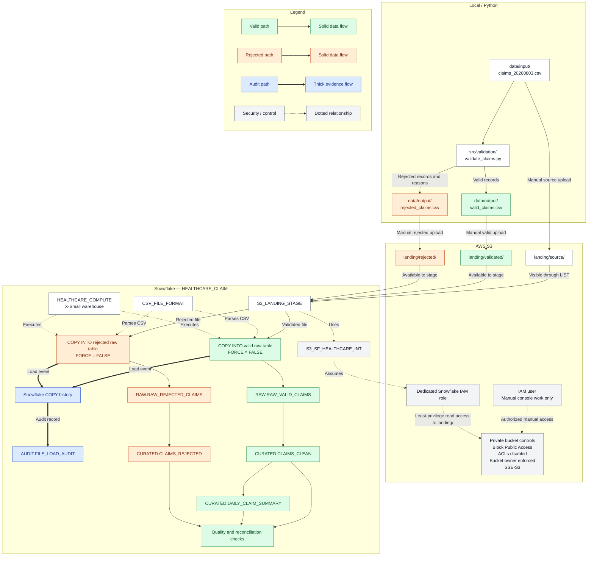

# Healthcare Claims Pipeline Architecture

This diagram shows the implemented M1–M6 foundation pipeline, including local validation, private S3 landing, Snowflake loading, auditing, curated transformations, and daily reconciliation.

